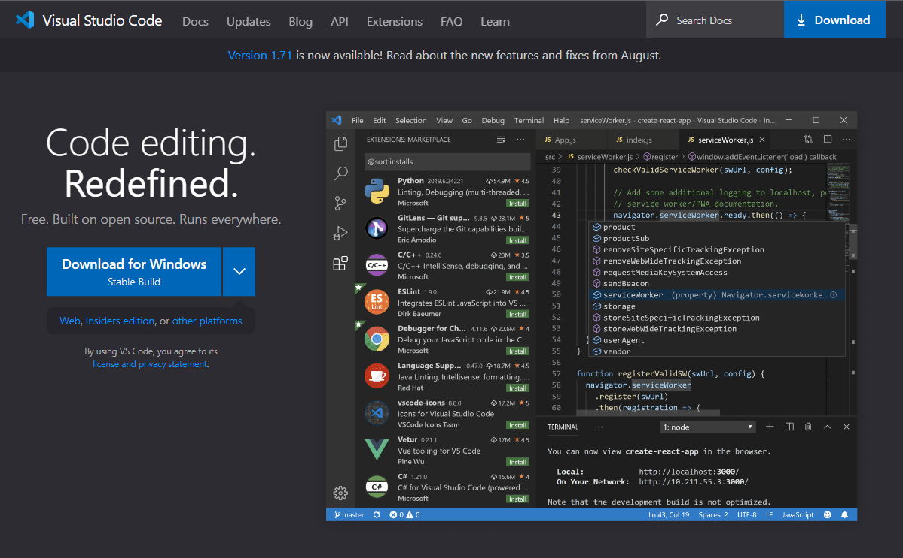
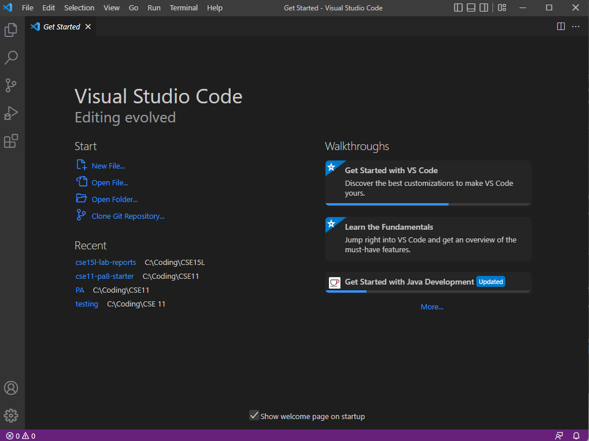
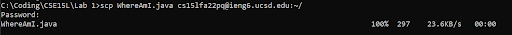
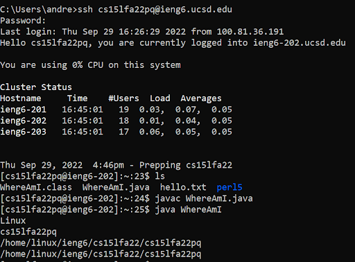
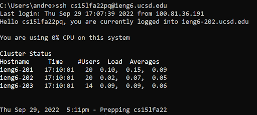

# Lab Report 1 - Remote Access and the Filesystem

## Installing VScode
- Head to the [VScode website](https://code.visualstudio.com/) and download the installer\

- After installation, your vscode should look something like this


## Remotely Connecting
- Open command prompt by typing `cmd` in the windows search bar.
- Type ``ssh <username>@ieng6.ucsd.edu`` 
- Enter in your password when prompted (nothing will appear when you type so don't freak out)\


## Trying Some Commands


## Moving Files with SCP
- Use this command to move files from the client to the remote computer\
``scp <filename> <username>@ieng6.ucsd.edu ``\

- Accessing and running the file on the remote server using\
``cd <file location>``\
``javac <filename>.java``\
``java <classname>``\


## Setting an SSH Key
- Type ``ssh-keygen`` to generate a public/priavte rsa key pair.
- Press enter with nothing entered for the prompts: \
``Enter file in which to save the key:``\
``Enter passphrase:``\
``Enter same passphrase again: ``
- Your command prompt should look something like this

``` 
# on client (your computer)
$ ssh-keygen
Generating public/private rsa key pair.
Enter file in which to save the key (/Users/andre/.ssh/id_rsa): /Users/andre/.ssh/id_rsa
Enter passphrase (empty for no passphrase): 
Enter same passphrase again: 
Your identification has been saved in /Users/andre/.ssh/id_rsa.
Your public key has been saved in /Users/andre/.ssh/id_rsa.pub.
The key fingerprint is:
SHA256:jZaZH6fI8E2I1D35hnvGeBePQ4ELOf2Ge+G0XknoXp0 
The key's randomart image is:
+---[RSA 3072]----+
|                 |
|       . . + .   |
|      . . B o .  |
|     . . B * +.. |
|      o S = *.B. |
|       = = O.*.*+|
|        + * *.BE+|
|           +.+.o |
|             ..  |
+----[SHA256]-----+ 
```
- Log onto the **remote** computer and enter\
``mkdir .ssh``\
``exit``

- SCP the public key (the file that ends in .pub) from the **client** to the remote computer\
``scp /Users/andre/.ssh/id_rsa.pub <username>@ieng6.ucsd.edu:~/.ssh/authorized_keys``


- Now you should be able to login to the **remote** computer without entering your password\

## Optimizing Remote Running