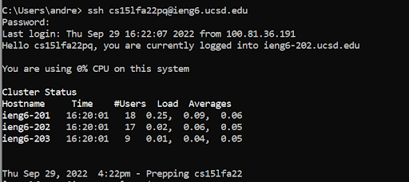

# Lab Report 1 - Remote Access and the Filesystem

# CSE 15L Lab Reports

## Installing VScode

## Remotely Connecting
- Open command prompt by typing `cmd` in the windows search bar.
- Type ``ssh cs15lfa22pq@ieng6.ucsd.edu`` but replace the `pq` with your own account
- Enter in your password when promoted (nothing will appear when you type so don't freak out)

## Trying Some Commands

## Moving Files with scp
-

## Setting an SSH Key

## Optimizing Remote Running