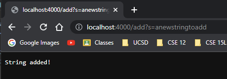
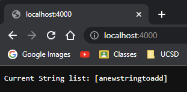
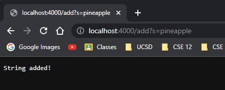
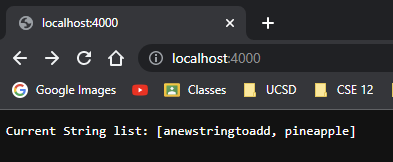
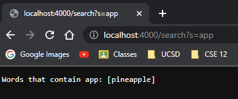

# Lab Report 2 - Server and Bugs

## Server - Search Engine
```
import java.io.IOException;
import java.net.URI;
import java.util.*;

class Handler implements URLHandler {
    // The one bit of state on the server: a number that will be manipulated by
    // various requests.
    List<String> list = new ArrayList<>();

    public String handleRequest(URI url) {  
        if (url.getPath().equals("/")) {
            return String.format("Current String list: %s", list.toString());
        } else if (url.getPath().contains("/add")) {
            System.out.println("Path: " + url.getPath());
            String[] parameters = url.getQuery().split("=");
            if(parameters[0].equals("s")){
                list.add(parameters[1]);
                return String.format("String added!");
            }
            return "404 Not Found!";
        } else {
            if(url.getPath().contains("/search")){
                System.out.println("Path: " + url.getPath());
                String[] parameters = url.getQuery().split("=");
                if (parameters[0].equals("s")) {
                    List<String> newList = new ArrayList<>();
                    for(String str : list){
                        if(str.contains(parameters[1])){
                            newList.add(str);
                        }
                    }
                    return String.format("Words that contain " + parameters[1] + ": %s", newList.toString());
                }
                
            }
            return "404 Not Found!";
        }
    }
}
class SearchEngine {
    public static void main(String[] args) throws IOException {
        if(args.length == 0){
            System.out.println("Missing port number! Try any number between 1024 to 49151");
            return;
        }

        int port = Integer.parseInt(args[0]);

        Server.start(port, new Handler());
    }
}
```
## Search Engine in Action

- The ``handleRequest(URL url)`` method was called and went into the ``if (url.getPath().contains("/add))`` if statement.
- It then proceeds to split the add call by the ``=`` sign with the left side of the sign being the add type and the right side of the sign being the value added into the list


- After checking if ``parameters[0].equals("s")``, the program appends ``parameters[1]`` into the list and displays on the website that the String was added.


- Repeat of image 1 but with a different String value.


- Repeat of image 2.


- The ``handleRequest(URL url)`` method was called and went into the ``if (url.getPath().contains("/search))`` if statement.
- It then proceeds to split the add call by the ``=`` sign with the left side of the sign being the add type and the right side of the sign being the value added into the list
- After checking if ``parameters[0].equals("s")``, the program appends creates a ``newList`` and appends the relevant Strings into that list.
- It then displays that contents of that list onto the webpage.\

## Bugs
### Bug #1
- Failure-inducing Input:
```
@Test 
public void testReverseInPlaceBug() {
    int[] input1 = { 3, 5, 7, 8 };
    ArrayExamples.reverseInPlace(input1);
    assertArrayEquals(new int[]{8, 7, 5, 3}, input1);
}
```

- Failure-inducing Ouput: 
```
1) testReverseInPlaceBug(ArrayTests)
arrays first differed at element [2]; expected:<5> but was:<7>
        at org.junit.internal.ComparisonCriteria.arrayEquals(ComparisonCriteria.java:78)
        at org.junit.internal.ComparisonCriteria.arrayEquals(ComparisonCriteria.java:28)
        at org.junit.Assert.internalArrayEquals(Assert.java:534)
        at org.junit.Assert.assertArrayEquals(Assert.java:418)
        at org.junit.Assert.assertArrayEquals(Assert.java:429)
        at ArrayTests.testReverseInPlaceBug(ArrayTests.java:16)
        ... 30 trimmed
Caused by: java.lang.AssertionError: expected:<5> but was:<7>
        at org.junit.Assert.fail(Assert.java:89)
        at org.junit.Assert.failNotEquals(Assert.java:835)
        at org.junit.Assert.assertEquals(Assert.java:120)
        at org.junit.Assert.assertEquals(Assert.java:146)
        at org.junit.internal.ExactComparisonCriteria.assertElementsEqual(ExactComparisonCriteria.java:8)
        at org.junit.internal.ComparisonCriteria.arrayEquals(ComparisonCriteria.java:76)
        ... 36 more

FAILURES!!!
Tests run: 1,  Failures: 1
```
- The Bug
- - The ``reverseInPlace(int[] arr)`` method was not replacing the value that was swapped with the element at the end while reversing. To fix this, I created a ``temp`` variable to store the element that was getting swapped and then reassigning ``temp`` to the element it got swapped with.
- Connection
- - The bug is there for any type of input greater with an array size **great than 1**. If the array is of size greater than 1, the bug will swap elements without replacing the element that got swapped, which produces an array that is not reversed.

### Bug #2
- Failure-inducing Input:
```
@Test
public void testMerge(){
    List<String> a = new ArrayList<>(Arrays.asList(
        new String[]{"hi, eat, eck"}
    ));

    List<String> b = new ArrayList<>(Arrays.asList(
        new String[]{"bruh, eat, slime"}
    ));

    Collections.sort(a);
    Collections.sort(b);

    List<String> ans = new ArrayList<>(Arrays.asList(
        new String[]{"bruh", "eat", "eat", "eck", "hi", "slime"}));

    assertEquals(ans, ListExamples.merge(a,b));
}
```

- Failure-inducing Ouput: 
```
1) testMerge(ListTests)
java.lang.AssertionError: expected:<[bruh, eat, eat, eck, hi, slime]> but was:<[bruh, eat, slime, hi, eat, eck]>
        at org.junit.Assert.fail(Assert.java:89)
        at org.junit.Assert.failNotEquals(Assert.java:835)
        at org.junit.Assert.assertEquals(Assert.java:120)
        at org.junit.Assert.assertEquals(Assert.java:146)
        at ListTests.testMerge(ListTests.java:44)

FAILURES!!!
Tests run: 1,  Failures: 1
```
- The Bug
- - When the ``merge()`` method adds on the remaining element from either list after going through both lists simultaneously, it increases ``index1`` by 1 instead of increasing ``index2``. Therefore, the fix for this bug is to change ``index1`` to ``index2`` in the second third while loop of the method.
- Connection
- - By increasing ``index1`` instead of ``index2``, the program will infinitely increase ``index1`` until it runs out of ``heap space`` as there is no condition to check for ``index1`` in this particular while loop.
