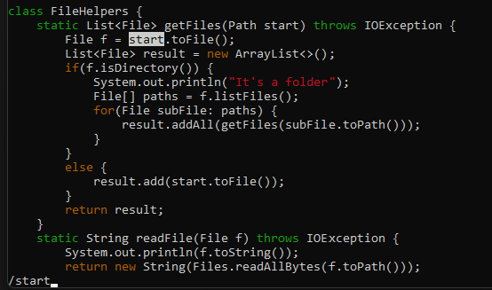
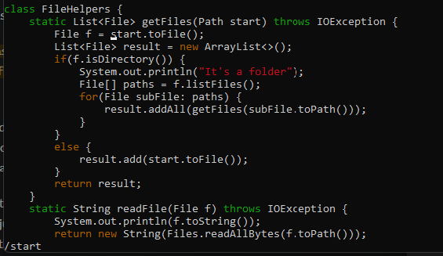
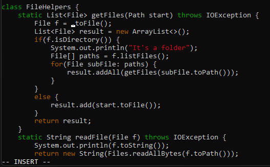
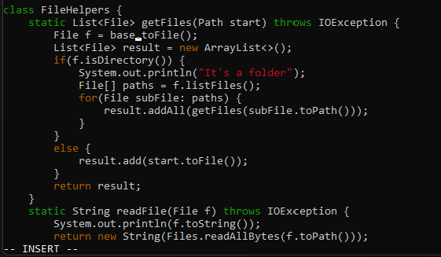
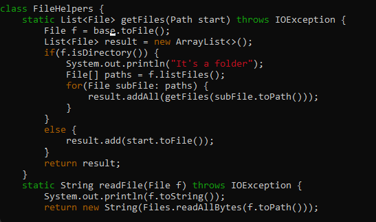
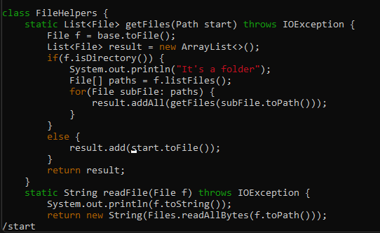
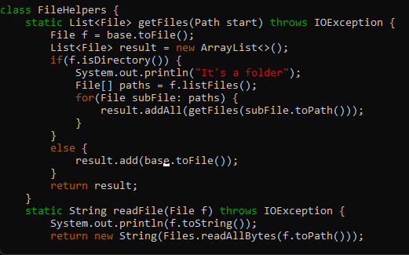
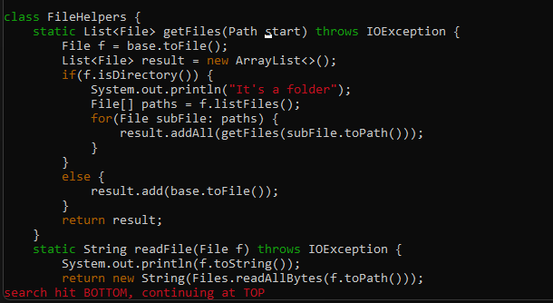
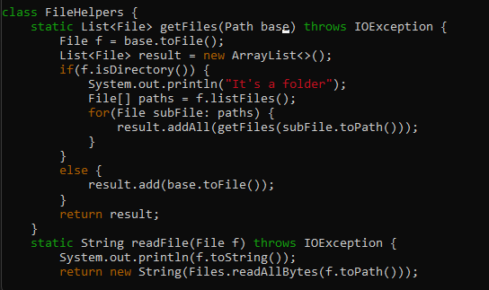
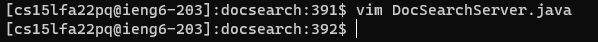

# Lab Report 4 - Vim

## Part 1

In ``DocSearchServer.java``, change the name of the ``start`` parameter of ``getFiles``, and all of its uses, to instead be called ``base``.

1. ``/`` ``s`` ``t`` ``a`` ``r`` ``t``\

- - Jumps to an occurrence of ``start`` 

2. ``<Enter>``\

- - Jumps cursor to the start of the word and exits the command input

3. ``c`` ``e``\

- - Deletes the word and starts in insert mode

4. ``b`` ``a`` ``s`` ``e``\

- - Writes the word ``base``

5. ``<esc>``\

- - Exits insert mode

6. ``n``\

- - Goes to the next occurrence of ``start``

7. ``.``\

- - Repeats the previous command, which was ``c`` ``e`` and ``b`` ``a`` ``s`` ``e``

8. ``n``\

- -  Goes to the next occurrence of ``start``

9. ``.``\

- - Repeats the previous command, which was ``c`` ``e`` and ``b`` ``a`` ``s`` ``e``

10. ``:`` ``w`` ``q``\

- - Saves and exits vim.

## Part 2

### Style 1
- Style 1 took me ``89.05`` seconds. The difficulty was typing the correct scp parameters.

### Style 2
- Style 2 took me ``30.88`` seconds. There were actually no difficulties that came up when I was executing this style. Everything went smoothly.

### Reflection
- I would prefer ``Style 2`` over ``Style 1`` due to the fact that there is no file transfer needed. Typing the ``scp`` command parameter take so long because I need to make sure I am accessing it in the right folder and transferring it to the right folder.

- If I just need to make a minor change, I would probably just use vim on the remote computer because the effort to ``scp`` it is just not worth the time to type that command. However, if I am working on a huge chunk of code, I would probably work on it in ``Visual Studio Code`` because the editing environment is just better and the cost of time transfer it to the report to the time spent working on the actualy project is less than ``Style 1``.

