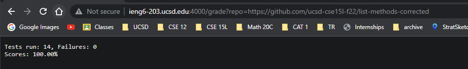

# Lab Report 5 - Grade Server
## ``grade.sh`` Code Block
```
1. TEST=TestListExamples
2. SUBMISSION=ListExamples.java
3. CPATH=.:../lib/hamcrest-core-1.3.jar:../lib/junit-4.13.2.jar
4.
5. i=1
6. for var in "$@"
7. do
8.    rm -rf student-submission
9.    git clone $var student-submission 2> /dev/null
10.
11.   if [[ $? -ne 0 ]]
12.       then
13.           echo Repo not found
14.           EXIT
15.   fi
16.
17.   cp $TESTS.java student-submission
18.   cp Score.java student-submission
19.
20.   cd student-submission
21.   if [[ ! -f $SUBMISSION ]]
22.       then
23.           echo File not found: $SUBMISSION
24.           EXIT
25.   fi
26.
27.   javac Score.java
28.   javac -cp $CPATH *.java 2> err.txt
29.   javac -cp $CPATH $SUBMISSION 2> err.txt
30.
31.   if [[ $? -ne 0 ]]
32.       then
33.           echo $SUBMISSION Compilation failed
34.           EXIT
35.   fi
36.
37.   java -cp $CPATH org.junit.runner.JUnit.Core $TESTS | grep "Tests run:" > results.txt
38.   cat results.txt
39.   VARS=(`grep -o '[0-9]' < results.txt`)
40.   echo Score: `java Score ${VARS[1]} ${VARS[2]} ${VARS[2]}`
41.done
```

## Student Submission 1

- 1. Assigns variable
- 2. Assigns variable
- 3. Assigns variable
- 4. Doesn't run (blank line)
- 5. Assigns varriable
- 6. For each student submission
- 7. Indicates a for loop body
- 8. remove student-submission file, return code zero, stdout is nothing, stderr is nothing
- 9. clones the repo, return code zero, stdout is nothing, stderr is nothing
- 10. Condition is false because the Repo is found\
- 11. Doesn't run - if branch
- 12. Doesn't run - if branch
- 13. Doesn't run - if branch
- 14. Doesn't run - if branch
- 15. Doesn't run - if branch
- 16. Doesn't run (blank line)
- 17. Copies TestListExamples into student-submission, return code zero, stdout is nothing, stderr is nothing
- 18. Copies Score.java into student-submission, return coede zero, stdout is nothing, stderr is nothing
- 19. Doesn't run (blank line)
- 20. Set current directory to student-submission, return code zero, stdout is nothing, stderr is nothing
- 21. Condition is false because the ListExamples.java is found
- 22. Doesn't run - if branch
- 23. Doesn't run - if branch
- 24. Doesn't run - if branch
- 25. Doesn't run - if branch
- 26. Doesn't run (blank line)
- 27. Compiles Score.java, return code zero, stdout is nothing, stderr is nothing
- 28. Compiles all java files, return code zero, stdout is nothing, stderr is nothing
- 29. Compiles all ListExamples files, return code zero, stdout is nothing, stderr is nothing
- 30. Doesn't run (blank line)
- 31. Condition is false because compilation was successfull
- 32. Doesn't run - if branch
- 33. Doesn't run - if branch
- 34. Doesn't run - if branch
- 35. Doesn't run - if branch
- 36. Doesn't run (blank line)
- 37. Runs the TestListExamples.java file, return code zero, stdout is "Tests run: 14, Failures: 4", stderr is nothing
- 38. Displays the results, return code zero, stdout is "Tests run: 14, Failures: 4", stderr is nothing
- 39. Reads in the raw score from the results.txt, return code zero, stdout is nothing, stderr is nothing
- 40. Displays the formatted score, return code zero, stdout is "Tests run: 14, Failures: 4 \n 71.43%", stderr is nothing
- 41. Done. Return code zero, stdout is nothing, stderr is nothing.

## Student Submission 2


## Student Submission 3
